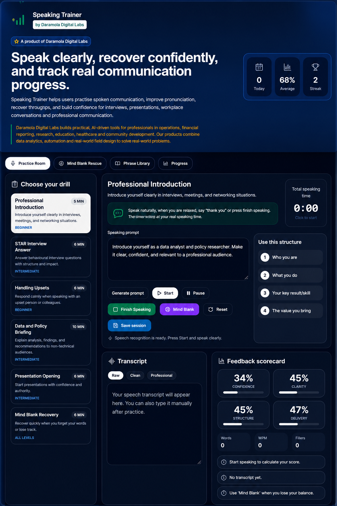

# Professional Speaking Trainer

AI-powered communication coaching platform that helps professionals improve public speaking, workplace communication, interviews, presentations, and pronunciation through real-time AI feedback.


🌐 **Live Demo:** https://speech.omoyelejd.co.uk

🏢 **Portfolio:** https://daramolajo.co.uk



---
## ✨ Highlights

- 🎤 Real-time speech coaching
- 🤖 AI-powered communication feedback
- 📝 Automatic transcript generation
- 📊 Progress tracking and analytics
- 🧠 Mind Blank Rescue assistance
- 💼 Interview and presentation practice
- 📚 Professional phrase library

> **Speaking Trainer dashboard** – real-time speech practice, feedback, transcript review, and confidence-building tools in one workspace.

**by Daramola Digital Labs**

> *Speak with confidence. Present with impact.*


**Speaking Trainer** by Daramola Digital Labs

Speaking Trainer helps users practise spoken communication, improve pronunciation, review transcripts, and build confidence for interviews, presentations, workplace conversations and professional communication.

---
## 🌐 Live Demo

**Application:** https://speech.omoyelejd.co.uk

## 🏢 About Daramola Digital Labs

Daramola Digital Labs builds practical, data-driven digital tools that support compliance, financial reporting, research, education, healthcare and community development. Our products combine data analysis, automation and user-centred design to solve real-world problems.

---

## ✨ Features

- **Live Communication Coaching:** Get real-time feedback on your pace, structure, and clarity.
- **Mind Blank Rescue:** Quickly recover when you lose your train of thought with intelligent prompts.
- **Progress Tracking:** Save your sessions, monitor your improvements, and track metrics like Words Per Minute (WPM) and filler words.
- **Phrase Library:** Access a comprehensive library of professional phrases for various scenarios.
- **Transcript Analysis:** Review your raw, cleaned, and professionally rewritten transcripts.

## Tech Stack

- **Frontend:** React 19 + TypeScript + Vite
- **Styling:** Tailwind CSS
- **Speech Recognition:** Web Speech API
- **AI:** Claude (Anthropic API)
- **State Management:** React Hooks
- **Hosting:** Vercel

## 🚀 Getting Started

To run the project locally, ensure you have Node.js installed.

1. Install dependencies:
   ```bash
   npm install
   ```

2. Start the development server:
   ```bash
   npm run dev
   ```

3. Build for production:
   ```bash
   npm run build
   ```
Open http://localhost:5173 in your browser.

## Privacy

- No user accounts required
- Speech remains in your browser unless AI feedback is requested
- No personal recordings are permanently stored
- API keys remain server-side

## Roadmap

Planned enhancements include:

- AI mock interview simulator
- Presentation coaching
- STAR interview practice
- Pronunciation scoring
- Workplace conversation scenarios
- Team learning dashboard
- Organisation analytics
- Mobile PWA support
- Voice history and progress reports
  
## 📄 License

© 2026 Daramola Digital Labs. All rights reserved.

Speaking Trainer is a product of Daramola Digital Labs.
